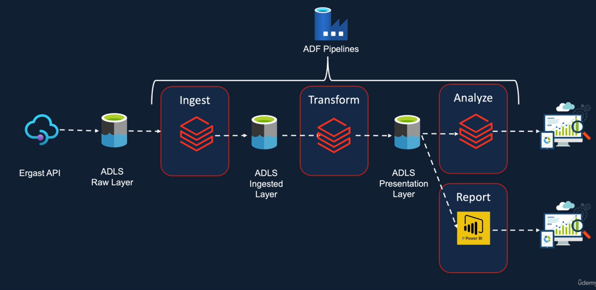

# Data Engineering using Azure Databricks, Delta Lake and Azure Data Factory

## Data Ingestion

### Circuits 
### Races

## Development Notes

- Formula 1 Data Transformation requirements; multiple formats incl. multi-part CSV and JSON files, audit columns/transformation metadata, transformation logic must handle incremental load and must be analyzable via SQL.
- Analysis Requirements; dominant drivers, dominant teams, visualized outputs and Databricks dashboards.